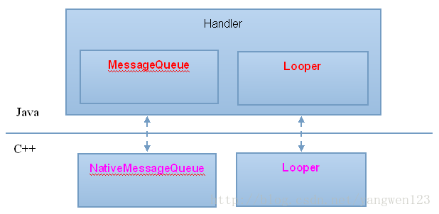
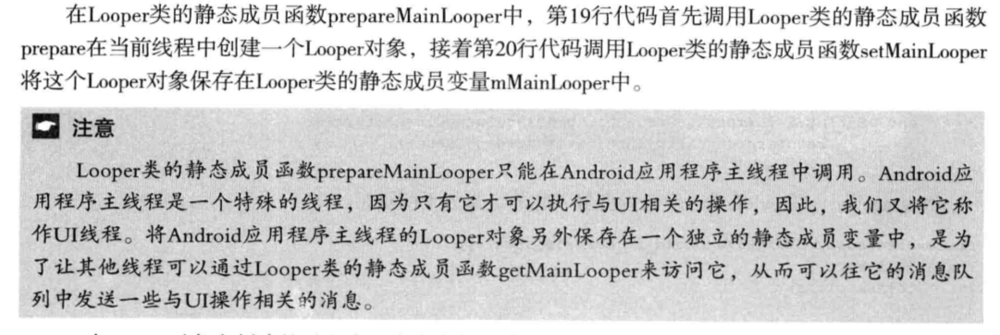

##Android应用程序的消息处理机制

1. 创建线程消息队列
	- 1 Android系统主要通过MessageQueue, Looper和Handler三个类来实现app的消息处理机制。
	- 2 消息队列使用一个MessageQueue对象来描述，可通过调用Looper类的静态函数prepareMainLooper(为主线程创建)和prepare(为子线程创建)来创建。
	- Java层和C++层的消息处理类的关系
	
	其中Java层中的每一个Looper对象内部都有一个类型为MessageQueue成员变量mQueue；C\+\+层中的每一个	NativeMessageQueue对象内部都有一个类型为Looper的成员变量mLooper，指向一个C\+\+Looper对象；Java层中的每一个MessageQueue对象都有一个类型为int的成员变量mPtr，保存了C\+\+层的一个NativeMessageQueue对象的地址。
	- 当一个线程的消息队列没有消息需要处理，该线程就会在管道的读端文件描述符(mWakeReadPipedFd)上睡眠，直到其他线程通过这个管道的写端文件描述符(mWakeWritePipedFd)来将其唤醒。
	- prepareMainLooper
	
	

