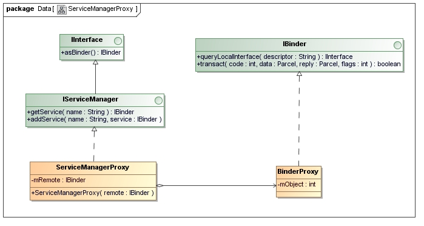
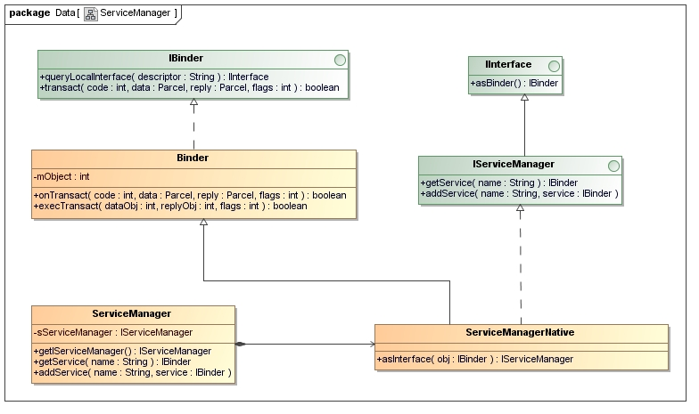

#Android Binder通信
##Android进程间通信（IPC）机制Binder简要介绍和学习计划
1. Binder具有粘结剂的意思，那么它把什么东西粘结在一起呢？在Android系统的Binder机制中，由一系统组件组成，分别是Client、Server、Service Manager和Binder驱动程序，其中Client、Server和Service Manager运行在用户空间，Binder驱动程序运行内核空间。Binder就是一种把这四个组件粘合在一起的粘结剂了，其中，核心组件便是Binder驱动程序了，Service Manager提供了辅助管理的功能，Client和Server正是在Binder驱动和Service Manager提供的基础设施上，进行Client-Server之间的通信。

　　　　　		　　　　　　　　　　　  图一

　　　　　　　　　　　　　　　　　　　　　图二

　　　　　　　　　　　　　　　　　　　　　图三

##Android Binder设计与实现 - 设计篇
1. 要想实现Client-Server通信据必须实现以下两点：一是server必须有确定的访问接入点或者说地址来接受Client的请求，并且Client可以通过某种途径获知Server的地址；二是制定Command-Reply协议来传输数据。对Binder而言，Binder可以看成Server提供的实现某个特定服务的访问接入点， Client通过这个‘地址’向Server发送请求来使用该服务；对Client而言，Binder可以看成是通向Server的管道入口，要想和某个Server通信首先必须建立这个管道并获得管道入口。
2. Binder使用了面向对象的思想来描述作为访问接入点的Binder及其在Client中的入口：Binder是一个实体位于Server中的对象，该对象提供了一套方法用以实现对服务的请求，就象类的成员函数。遍布于client中的入口可以看成指向这个binder对象的‘指针’，一旦获得了这个‘指针’就可以调用该对象的方法访问server。在Client看来，通过Binder‘指针’调用其提供的方法和通过指针调用其它任何本地对象的方法并无区别，尽管前者的实体位于远端Server中，而后者实体位于本地内存中。‘指针’是C++的术语，而更通常的说法是引用，即Client通过Binder的引用访问Server。
3. 面向对象思想的引入将进程间通信转化为通过对某个Binder对象的引用调用该对象的方法，而其独特之处在于Binder对象是一个可以跨进程引用的对象，它的实体位于一个进程中，而它的引用却遍布于系统的各个进程之中。最诱人的是，这个引用和Java里引用一样既可以是强类型，也可以是弱类型，而且可以从一个进程传给其它进程，让大家都能访问同一Server，就象将一个对象或引用赋值给另一个引用一样。Binder模糊了进程边界，淡化了进程间通信过程，整个系统仿佛运行于同一个面向对象的程序之中。形形色色的Binder对象以及星罗棋布的引用仿佛粘接各个应用程序的胶水，这也是Binder在英文里的原意。
4. 驱动和应用程序之间定义了一套接口协议，主要功能由ioctl()接口实现，不提供read()，write()接口，因为ioctl()灵活方便，且能够一次调用实现先写后读以满足同步交互，而不必分别调用write()和read()。Binder驱动的代码位于linux目录的drivers/misc/binder.c中。
5. Binder的实现比较巧妙：预先创造一只鸡来孵蛋：SMgr和其它进程同样采用Binder通信，SMgr是Server端，有自己的Binder对象（实体），其它进程都是Client，需要通过这个Binder的引用来实现Binder的注册，查询和获取。SMgr提供的Binder比较特殊，它没有名字也不需要注册，当一个进程使用BINDER_SET_CONTEXT_MGR命令将自己注册成SMgr时Binder驱动会自动为它创建Binder实体（这就是那只预先造好的鸡）。其次这个Binder的引用在所有Client中都固定为0而无须通过其它手段获得。也就是说，一个Server若要向SMgr注册自己Binder就必需通过0这个引用号和SMgr的Binder通信。类比网络通信，0号引用就好比域名服务器的地址，你必须预先手工或动态配置好。要注意这里说的Client是相对SMgr而言的，一个应用程序可能是个提供服务的Server，但对SMgr来说它仍然是个Client。
6. Server向SMgr注册了Binder实体及其名字后，Client就可以通过名字获得该Binder的引用了。Client也利用保留的0号引用向SMgr请求访问某个Binder：我申请获得名字叫张三的Binder的引用。SMgr收到这个连接请求，从请求数据包里获得Binder的名字，在查找表里找到该名字对应的条目，从条目中取出Binder的引用，将该引用作为回复发送给发起请求的Client。从面向对象的角度，这个Binder对象现在有了两个引用：一个位于SMgr中，一个位于发起请求的Client中。如果接下来有更多的Client请求该Binder，系统中就会有更多的引用指向该Binder，就象java里一个对象存在多个引用一样。而且类似的这些指向Binder的引用是强类型，从而确保只要有引用Binder实体就不会被释放掉。通过以上过程可以看出，SMgr象个火车票代售点，收集了所有火车的车票，可以通过它购买到乘坐各趟火车的票-得到某个Binder的引用。
7. 参与Binder通信的所有角色

8. Binder协议
Binder协议基本格式是（命令+数据），使用ioctl(fd, cmd, arg)函数实现交互。命令由参数cmd承载，数据由参数arg承载，随cmd不同而不同。

这其中最常用的命令是BINDER_WRITE_READ。该命令的参数包括两部分数据：一部分是向Binder写入的数据，一部分是要从Binder读出的数据，驱动程序先处理写部分再处理读部分。这样安排的好处是应用程序可以很灵活地处理命令的同步或异步。例如若要发送异步命令可以只填入写部分而将read_size置成0；若要只从Binder获得数据可以将写部分置空即write_size置成0；若要发送请求并同步等待返回数据可以将两部分都置上
	-  BINDER_WRITE_READ 之写操作
Binder写操作的数据时格式同样也是（命令+数据）。这时候命令和数据都存放在binder_write_read 结构write_buffer域指向的内存空间里，多条命令可以连续存放。数据紧接着存放在命令后面


**在这些命令中，最常用的是BC_TRANSACTION/BC_REPLY命令对，Binder请求和应答数据就是通过这对命令发送给接收方。这对命令所承载的数据包由结构体struct binder_transaction_data定义。Binder交互有同步和异步之分，利用binder_transaction_data中flag域区分。如果flag域的TF_ONE_WAY位为1则为异步交互，即Client端发送完请求交互即结束， Server端不再返回BC_REPLY数据包；否则Server会返回BC_REPLY数据包，Client端必须等待接收完该数据包方才完成一次交互。**
	- BINDER_WRITE_READ ：从Binder读出数据
从Binder里读出的数据格式和向Binder中写入的数据格式一样，采用（消息ID+数据）形式，并且多条消息可以连续存放。下表列举了从Binder读出的命令字及其相应的参数：


和写数据一样，其中最重要的消息是BR_TRANSACTION 或BR_REPLY，表明收到了一个格式为binder_transaction_data的请求数据包（BR_TRANSACTION）或返回数据包（BR_REPLY）。

9. binder_transaction_data
```cpp
struct binder_transaction_data {
	/* The first two are only used for bcTRANSACTION and brTRANSACTION,
	 * identifying the target and contents of the transaction.
	 */
	union {
		size_t	handle;	/* target descriptor of command transaction */
		void	*ptr;	/* target descriptor of return transaction */
	} target;
	void		*cookie;	/* target object cookie */
	unsigned int	code;		/* transaction command */

	/* General information about the transaction. */
	unsigned int	flags;
	pid_t		sender_pid;
	uid_t		sender_euid;
	size_t		data_size;	/* number of bytes of data */
	size_t		offsets_size;	/* number of bytes of offsets */

	/* If this transaction is inline, the data immediately
	 * follows here; otherwise, it ends with a pointer to
	 * the data buffer.
	 */
	union {
		struct {
			/* transaction data */
			const void	*buffer;
			/* offsets from buffer to flat_binder_object structs */
			const void	*offsets;
		} ptr;
		uint8_t	buf[8];
	} data;
};
```


这里有必要再强调一下offsets_size和data.offsets两个成员，这是Binder通信有别于其它IPC的地方。如前述，Binder采用面向对象的设计思想，一个Binder实体可以发送给其它进程从而建立许多跨进程的引用；另外这些引用也可以在进程之间传递，就象java里将一个引用赋给另一个引用一样。为Binder在不同进程中建立引用必须有驱动的参与，由驱动在内核创建并注册相关的数据结构后接收方才能使用该引用。而且这些引用可以是强类型，需要驱动为其维护引用计数。然而这些跨进程传递的Binder混杂在应用程序发送的数据包里，数据格式由用户定义，如果不把它们一一标记出来告知驱动，驱动将无法从数据中将它们提取出来。于是就使用数组data.offsets存放用户数据中每个Binder相对data.buffer的偏移量，用offsets_size表示这个数组的大小。驱动在发送数据包时会根据data.offsets和offset_size将散落于data.buffer中的Binder找出来并一一为它们创建相关的数据结构。在数据包中传输的Binder是类型为struct flat_binder_object的结构体。对于接收方来说，该结构只相当于一个定长的消息头，真正的用户数据存放在data.buffer所指向的缓存区中。如果发送方在数据中内嵌了一个或多个Binder，接收到的数据包中同样会用data.offsets和offset_size指出每个Binder的位置和总个数。不过通常接收方可以忽略这些信息，因为接收方是知道数据格式的，参考双方约定的格式定义就能知道这些Binder在什么位置。

10. Binder的表述
考察一次Binder通信的全过程会发现，Binder存在于系统以下几个部分中：
· 应用程序进程：分别位于Server进程和Client进程中
· Binder驱动：分别管理为Server端的Binder实体和Client端的引用
· 传输数据：由于Binder可以跨进程传递，需要在传输数据中予以表述
在系统不同部分，Binder实现的功能不同，表现形式也不一样。接下来逐一探讨Binder在各部分所扮演的角色和使用的数据结构。
	- Binder 在应用程序中的表述
如何将Binder和Proxy设计模式结合起来是应用程序实现面向对象Binder通信的根本问题。
		- Binder 在Server端的表述 – Binder实体
做为Proxy设计模式的基础，首先定义一个抽象接口类封装Server所有功能，其中包含一系列纯虚函数留待Server和Proxy各自实现。由于这些函数需要跨进程调用，须为其一一编号，从而Server可以根据收到的编号决定调用哪个函数。其次就要引入Binder了。Server端定义另一个Binder抽象类处理来自Client的Binder请求数据包，其中最重要的成员是虚函数onTransact()。该函数分析收到的数据包，调用相应的接口函数处理请求。
接下来采用继承方式以接口类和Binder抽象类为基类构建Binder在Server中的实体，实现基类里所有的虚函数，包括公共接口函数以及数据包处理函数：onTransact()。这个函数的输入是来自Client的binder_transaction_data结构的数据包。前面提到，该结构里有个成员code，包含这次请求的接口函数编号。onTransact()将case-by-case地解析code值，从数据包里取出函数参数，调用接口类中相应的，已经实现的公共接口函数。函数执行完毕，如果需要返回数据就再构建一个binder_transaction_data包将返回数据包填入其中。那么各个Binder实体的onTransact()又是什么时候调用呢？这就需要驱动参与了。
前面说过，Binder实体须要以Binde传输结构flat_binder_object形式发送给其它进程才能建立Binder通信，而Binder实体指针就存放在该结构的handle域中。驱动根据Binder位置数组从传输数据中获取该Binder的传输结构，为它创建位于内核中的Binder节点，将Binder实体指针记录在该节点中。如果接下来有其它进程向该Binder发送数据，驱动会根据节点中记录的信息将Binder实体指针填入binder_transaction_data的target.ptr中返回给接收线程。接收线程从数据包中取出该指针，reinterpret_cast成Binder抽象类并调用onTransact()函数。由于这是个虚函数，不同的Binder实体中有各自的实现，从而可以调用到不同Binder实体提供的onTransact()。
		-  Binder 在Client端的表述 – Binder引用
Client端的Binder同样要继承Server提供的公共接口类并实现公共函数。但这不是真正的实现，而是对远程函数调用的包装：将函数参数打包，通过Binder向Server发送申请并等待返回值。为此Client端的Binder还要知道Binder实体的相关信息，即对Binder实体的引用。该引用或是由SMgr转发过来的，对实名Binder的引用或是由另一个进程直接发送过来的，对匿名Binder的引用。
由于继承了同样的公共接口类，Client Binder提供了与Server Binder一样的函数原型，使用户感觉不出Server是运行在本地还是远端。Client Binder中，公共接口函数的包装方式是：创建一个binder_transaction_data数据包，将其对应的编码填入code域，将调用该函数所需的参数填入data.buffer指向的缓存中，并指明数据包的目的地，那就是已经获得的对Binder实体的引用，填入数据包的target.handle中。注意这里和Server的区别：实际上target域是个联合体，包括ptr和handle两个成员，前者用于接收数据包的Server，指向 Binder实体对应的内存空间；后者用于作为请求方的Client，存放Binder实体的引用，告知驱动数据包将路由给哪个实体。数据包准备好后，通过驱动接口发送出去。经过BC_TRANSACTION/BC_REPLY回合完成函数的远程调用并得到返回值。
		- Binder 在传输数据中的表述
Binder可以塞在数据包的有效数据中越进程边界从一个进程传递给另一个进程，这些传输中的Binder用结构flat_binder_object表示.
```cpp
struct flat_binder_object {
	/* 8 bytes for large_flat_header. */
	unsigned long		type;
	unsigned long		flags;
	/* 8 bytes of data. */
	union {
		void		*binder;	/* local object */
		signed long	handle;		/* remote object */
	};
	/* extra data associated with local object */
	void			*cookie;
};
```

无论是Binder实体还是对实体的引用都从属与某个进程，所以该结构不能透明地在进程之间传输，必须经过驱动翻译。例如当Server把Binder实体传递给Client时，在发送数据流中，flat_binder_object中的type是BINDER_TYPE_BINDER，binder指向Server进程用户空间地址。如果透传给接收端将毫无用处，驱动必须对数据流中的这个Binder做修改：将type该成BINDER_TYPE_HANDLE；为这个Binder在接收进程中创建位于内核中的引用并将引用号填入handle中。对于发生数据流中引用类型的Binder也要做同样转换。经过处理后接收进程从数据流中取得的Binder引用才是有效的，才可以将其填入数据包binder_transaction_data的target.handle域，向Binder实体发送请求。
这样做也是出于安全性考虑：应用程序不能随便猜测一个引用号填入target.handle中就可以向Server请求服务了，因为驱动并没有为你在内核中创建该引用，必定会被驱动拒绝。唯有经过身份认证确认合法后，由‘权威机构’（Binder驱动）亲手授予你的Binder才能使用，因为这时驱动已经在内核中为你使用该Binder做了注册，交给你的引用号是合法的。
下表总结了当flat_binder_object结构穿过驱动时驱动所做的操作：

	- Binder在驱动中的表述
驱动是Binder通信的核心，系统中所有的Binder实体以及每个实体在各个进程中的引用都登记在驱动中；驱动需要记录Binder引用->实体之间多对一的关系；为引用找到对应的实体；在某个进程中为实体创建或查找到对应的引用；记录Binder的归属地（位于哪个进程中）；通过管理Binder的强/弱引用创建/销毁Binder实体等等。
驱动里的Binder是什么时候创建的呢？前面提到过，为了实现实名Binder的注册，系统必须创建第一只鸡–为SMgr创建的，用于注册实名Binder的Binder实体，负责实名Binder注册过程中的进程间通信。既然创建了实体就要有对应的引用：驱动将所有进程中的0号引用都预留给该Binder实体，即所有进程的0号引用天然地都指向注册实名Binder专用的Binder，无须特殊操作即可以使用0号引用来注册实名Binder。接下来随着应用程序不断地注册实名Binder，不断向SMgr索要Binder的引用，不断将Binder从一个进程传递给另一个进程，越来越多的Binder以传输结构 - flat_binder_object的形式穿越驱动做跨进程的迁徙。由于binder_transaction_data中data.offset数组的存在，所有流经驱动的Binder都逃不过驱动的眼睛。Binder将对这些穿越进程边界的Binder做如下操作：检查传输结构的type域，如果是BINDER_TYPE_BINDER或BINDER_TYPE_WEAK_BINDER则创建Binder的实体；如果是BINDER_TYPE_HANDLE或BINDER_TYPE_WEAK_HANDLE则创建Binder的引用；如果是BINDER_TYPE_HANDLE则为进程打开文件，无须创建任何数据结构。详细过程可参考表7。随着越来越多的Binder实体或引用在进程间传递，驱动会在内核里创建越来越多的节点或引用，当然这个过程对用户来说是透明的。
		- Binder 实体在驱动中的表述
驱动中的Binder实体也叫‘节点’，隶属于提供实体的进程，由struct binder_node结构来表示：
```cpp
struct binder_node {
	int debug_id;
	struct binder_work work;
	union {
		struct rb_node rb_node;
		struct hlist_node dead_node;
	};
	struct binder_proc *proc;
	struct hlist_head refs;
	int internal_strong_refs;
	int local_weak_refs;
	int local_strong_refs;
	void __user *ptr;
	void __user *cookie;
	unsigned has_strong_ref : 1;
	unsigned pending_strong_ref : 1;
	unsigned has_weak_ref : 1;
	unsigned pending_weak_ref : 1;
	unsigned has_async_transaction : 1;
	unsigned accept_fds : 1;
	int min_priority : 8;
	struct list_head async_todo;
};
```


		- Binder 引用在驱动中的表述
和实体一样，Binder的引用也是驱动根据传输数据中的flat_binder_object创建的，隶属于获得该引用的进程，用struct binder_ref结构体表示
```cpp
struct binder_ref {
	/* Lookups needed: */
	/*   node + proc => ref (transaction) */
	/*   desc + proc => ref (transaction, inc/dec ref) */
	/*   node => refs + procs (proc exit) */
	int debug_id;
	struct rb_node rb_node_desc;
	struct rb_node rb_node_node;
	struct hlist_node node_entry;
	struct binder_proc *proc;
	struct binder_node *node;
	uint32_t desc;
	int strong;
	int weak;
	struct binder_ref_death *death;
};
```

不同的是Binder的引用可以通过两个键值索引：
· 对应实体在内核中的地址。注意这里指的是驱动创建于内核中的binder_node结构的地址，而不是Binder实体在用户进程中的地址。实体在内核中的地址是唯一的，用做索引不会产生二义性；但实体可能来自不同用户进程，而实体在不同用户进程中的地址可能重合，不能用来做索引。驱动利用该红黑树在一个进程中快速查找某个Binder实体所对应的引用（一个实体在一个进程中只建立一个引用）。                                                                                                                                                                                                                                                                                                                                                                                                                                                                                                                                                                                                                                                                                                                                                                                                                                                                                                                                                                                                                                                                                                                                                                                                                                                                                                                                                                                                                                                                                                                                                                                                                                                                                                                                                                                                                                                                                                                                                                                                                                                                                                                                                                                                                                                                                                                                                                                                                                                                                                                                                                                                                                                                                                                                                                                                                                                                                                                                                                                                                                                                                                                                                                                                                                                                                                                                                                                                                                                                                                                                                                                                                                                                                                                                                                                                          
· 引用号。引用号是驱动为引用分配的一个32位标识，在一个进程内是唯一的，而在不同进程中可能会有同样的值，这和进程的打开文件号很类似。引用号将返回给应用程序，可以看作Binder引用在用户进程中的句柄。除了0号引用在所有进程里都固定保留给SMgr，其它值由驱动动态分配。向Binder发送数据包时，应用程序将引用号填入binder_transaction_data结构的target.handle域中表明该数据包的目的Binder。驱动根据该引用号在红黑树中找到引用的binder_ref结构，进而通过其node域知道目标Binder实体所在的进程及其它相关信息，实现数据包的路由。

12. Binder 内存映射和接收缓存区管理
 Binder采用一种全新策略：由Binder驱动负责管理数据接收缓存。我们注意到Binder驱动实现了mmap()系统调用，这对字符设备是比较特殊的，因为mmap()通常用在有物理存储介质的文件系统上，而象Binder这样没有物理介质，纯粹用来通信的字符设备没必要支持mmap()。Binder驱动当然不是为了在物理介质和用户空间做映射，而是用来创建数据接收的缓存空间。先看mmap()是如何使用的：
fd = open("/dev/binder", O_RDWR);
mmap(NULL, MAP_SIZE, PROT_READ, MAP_PRIVATE, fd, 0);
这样Binder的接收方就有了一片大小为MAP_SIZE的接收缓存区。mmap()的返回值是内存映射在用户空间的地址，不过这段空间是由驱动管理，用户不必也不能直接访问（映射类型为PROT_READ，只读映射）。
接收缓存区映射好后就可以做为缓存池接收和存放数据了。前面说过，接收数据包的结构为binder_transaction_data，但这只是消息头，真正的有效负荷位于data.buffer所指向的内存中。这片内存不需要接收方提供，恰恰是来自mmap()映射的这片缓存池。在数据从发送方向接收方拷贝时，驱动会根据发送数据包的大小，使用最佳匹配算法从缓存池中找到一块大小合适的空间，将数据从发送缓存区复制过来。有分配必然有释放。接收方在处理完数据包后，就要通知驱动释放data.buffer所指向的内存区。在介绍Binder协议时已经提到，这是由命令BC_FREE_BUFFER完成的。
为了实现用户空间到用户空间的拷贝，mmap()分配的内存除了映射进了接收方进程里，还映射进了内核空间。所以调用copy_from_user()将数据拷贝进内核空间也相当于拷贝进了接收方的用户空间，这就是Binder只需一次拷贝的‘秘密’。
13. Binder 接收线程管理
可是对于Binder来说，既没有侦听模式也不会下蛋，怎样管理线程池呢？一种简单的做法是，不管三七二十一，先创建一堆线程，每个线程都用BINDER_WRITE_READ命令读Binder。这些线程会阻塞在驱动为该Binder设置的等待队列上，一旦有来自Client的数据驱动会从队列中唤醒一个线程来处理。这样做简单直观，省去了线程池，但一开始就创建一堆线程有点浪费资源。于是Binder协议引入了专门命令或消息帮助用户管理线程池，包括：
· INDER_SET_MAX_THREADS
· BC_REGISTER_LOOP
· BC_ENTER_LOOP
· BC_EXIT_LOOP
· BR_SPAWN_LOOPER
首先要管理线程池就要知道池子有多大，应用程序通过INDER_SET_MAX_THREADS告诉驱动最多可以创建几个线程。以后每个线程在创建，进入主循环，退出主循环时都要分别使用BC_REGISTER_LOOP，BC_ENTER_LOOP，BC_EXIT_LOOP告知驱动，以便驱动收集和记录当前线程池的状态。每当驱动接收完数据包返回读Binder的线程时，都要检查一下是不是已经没有闲置线程了。如果是，而且线程总数不会超出线程池最大线程数，就会在当前读出的数据包后面再追加一条BR_SPAWN_LOOPER消息，告诉用户线程即将不够用了，请再启动一些，否则下一个请求可能不能及时响应。新线程一启动又会通过BC_xxx_LOOP告知驱动更新状态。这样只要线程没有耗尽，总是有空闲线程在等待队列中随时待命，及时处理请求。

13.  数据包接收队列与（线程）等待队列管理
通常数据传输的接收端有两个队列：数据包接收队列和（线程）等待队列，用以缓解供需矛盾。当超市里的进货（数据包）太多，货物会堆积在仓库里；购物的人（线程）太多，会排队等待在收银台.
 由于发送时没有特别标记，驱动怎么判断哪些数据包该送入全局to-do队列，哪些数据包该送入特定线程的to-do队列呢？这里有两条规则。规则1：Client发给Server的请求数据包都提交到Server进程的全局to-do队列。不过有个特例，就是上节谈到的Binder对工作线程启动的优化。经过优化，来自T1的请求不是提交给P2的全局to-do队列，而是送入了T2的私有to-do队列。规则2：对同步请求的返回数据包（由BC_REPLY发送的包）都发送到发起请求的线程的私有to-do队列中。如上面的例子，如果进程P1的线程T1发给进程P2的线程T2的是同步请求，那么T2返回的数据包将送进T1的私有to-do队列而不会提交到P1的全局to-do队列。
数据包进入接收队列的潜规则也就决定了线程进入等待队列的潜规则，即一个线程只要不接收返回数据包则应该在全局等待队列中等待新任务，否则就应该在其私有等待队列中等待Server的返回数据。还是上面的例子，T1在向T2发送同步请求后就必须等待在它私有等待队列中，而不是在P1的全局等待队列中排队，否则将得不到T2的返回的数据包。
接下来探讨一下Binder驱动是如何递交同步交互和异步交互的。我们知道，同步交互和异步交互的区别是同步交互的请求端（client）在发出请求数据包后须要等待应答端（Server）的返回数据包，而异步交互的发送端发出请求数据包后交互即结束。对于这两种交互的请求数据包，驱动可以不管三七二十一，统统丢到接收端的to-do队列中一个个处理。但驱动并没有这样做，而是对异步交互做了限流，令其为同步交互让路，具体做法是：对于某个Binder实体，只要有一个异步交互没有处理完毕，例如正在被某个线程处理或还在任意一条to-do队列中排队，那么接下来发给该实体的异步交互包将不再投递到to-do队列中，而是阻塞在驱动为该实体开辟的异步交互接收队列（Binder节点的async_todo域）中，但这期间同步交互依旧不受限制直接进入to-do队列获得处理。一直到该异步交互处理完毕下一个异步交互方可以脱离异步交互队列进入to-do队列中。之所以要这么做是因为同步交互的请求端需要等待返回包，必须迅速处理完毕以免影响请求端的响应速度，而异步交互属于‘发射后不管’，稍微延时一点不会阻塞其它线程。所以用专门队列将过多的异步交互暂存起来，以免突发大量异步交互挤占Server端的处理能力或耗尽线程池里的线程，进而阻塞同步交互。

##浅谈Service Manager成为Android进程间通信（IPC）机制Binder守护进程之路
1. Service Manager的入口位于service_manager.c文件中的main函数：
```cpp
//Service Manager进程中
    int main(int argc, char **argv)  
    {  
        struct binder_state *bs;  
        void *svcmgr = BINDER_SERVICE_MANAGER;  
        bs = binder_open(128*1024);  
        if (binder_become_context_manager(bs)) {  
            LOGE("cannot become context manager (%s)\n", strerror(errno));  
            return -1;  
        }  
        svcmgr_handle = svcmgr;  
        binder_loop(bs, svcmgr_handler);  
        return 0;  
    }  
```
main函数主要有三个功能：一是打开Binder设备文件；二是告诉Binder驱动程序自己是Binder上下文管理者，即我们前面所说的守护进程；三是进入一个无穷循环，充当Server的角色，等待Client的请求。
```cpp
    struct binder_state  
    {  
        int fd;  
        void *mapped;  
        unsigned mapsize;  
    };  
```
fd是文件描述符，即表示打开的/dev/binder设备文件描述符；mapped是把设备文件/dev/binder映射到进程空间的起始地址；mapsize是上述内存映射空间的大小
在Service Manger进程中binder_open函数就是打开/dev/binder设备文件，然后将其映射到自己的地址空间，映射信息保存在binder_state对象中。
```cpp
/* the one magic object */  
#define BINDER_SERVICE_MANAGER ((void*) 0) 
```
它表示Service Manager的句柄为0。Binder通信机制使用句柄来代表远程接口，这个句柄的意义和Windows编程中用到的句柄是差不多的概念。前面说到，Service Manager在充当守护进程的同时，它充当Server的角色，当它作为远程接口使用时，它的句柄值便为0，这就是它的特殊之处，其余的Server的远程接口句柄值都是一个大于0 而且由Binder驱动程序自动进行分配的。

2. Binder驱动程序中的binder_open函数
前面执行open("/dev/binder", O_RDWR)就进入到Binder驱动程序的binder_open函数
```cpp
//前面main函数中调用open打开/dev/binder文件时，实际调用的是该函数，内核代service manager进程执行
static int binder_open(struct inode *nodp, struct file *filp)  
{  
    struct binder_proc *proc;  
    if (binder_debug_mask & BINDER_DEBUG_OPEN_CLOSE)  
        printk(KERN_INFO "binder_open: %d:%d\n", current->group_leader->pid, current->pid);  
    proc = kzalloc(sizeof(*proc), GFP_KERNEL);  
    if (proc == NULL)  
        return -ENOMEM;  
    get_task_struct(current);  
    proc->tsk = current;  
    INIT_LIST_HEAD(&proc->todo);  
    init_waitqueue_head(&proc->wait);  
    proc->default_priority = task_nice(current);  
    mutex_lock(&binder_lock);  
    binder_stats.obj_created[BINDER_STAT_PROC]++;  
    hlist_add_head(&proc->proc_node, &binder_procs);  
    proc->pid = current->group_leader->pid;  
    INIT_LIST_HEAD(&proc->delivered_death);  
    filp->private_data = proc;  
    mutex_unlock(&binder_lock);  
    if (binder_proc_dir_entry_proc) {  
        char strbuf[11];  
        snprintf(strbuf, sizeof(strbuf), "%u", proc->pid);  
        remove_proc_entry(strbuf, binder_proc_dir_entry_proc);  
        create_proc_read_entry(strbuf, S_IRUGO, binder_proc_dir_entry_proc, binder_read_proc_proc, proc);  
    }  
    return 0;  
}
```
这个函数的主要作用是创建一个struct binder_proc数据结构来保存打开设备文件/dev/binder的进程的上下文信息，并且将这个进程上下文信息保存在打开文件结构struct file的私有数据成员变量private_data中，这样，在执行其它文件操作时，就通过打开文件结构struct file来取回这个进程上下文信息了。这个进程上下文信息同时还会保存在一个全局哈希表binder_procs中，驱动程序内部使用。
```cpp
    struct binder_proc {  
        struct hlist_node proc_node;  
/*threads树用来保存binder_proc进程内用于处理用户请求的线程，它的最大数量由max_threads来决定；*/
        struct rb_root threads;  
/*node树成用来保存binder_proc进程内的Binder实体*/
        struct rb_root nodes;  
/*refs_by_desc树和refs_by_node树用来保存binder_proc进程内的Binder引用，即引用的其它进程的Binder实体，它分别用两种方式来组织红黑树，一种是以句柄作来key值来组织，一种是以引用的实体节点的地址值作来key值来组织，它们都是表示同一样东西，只不过是为了内部查找方便而用两个红黑树来表示。*/
        struct rb_root refs_by_desc;  
        struct rb_root refs_by_node;  
        int pid;  
        struct vm_area_struct *vma;  
        struct task_struct *tsk;  
        struct files_struct *files;  
        struct hlist_node deferred_work_node;  
        int deferred_work;
/*buffer成员变量是一个void*指针，它表示要映射的物理内存在内核空间中的起始位置；*/
        void *buffer;
/*user_buffer_offset成员变量是一个ptrdiff_t类型的变量，它表示的是内核使用的虚拟地址与进程使用的虚拟地址之间的差值，即如果某个物理页面在内核空间中对应的虚拟地址是addr的话，那么这个物理页面在进程空间对应的虚拟地址就为addr + user_buffer_offset。便于快速计算出地址*/
        ptrdiff_t user_buffer_offset;  
      
        struct list_head buffers;  
        struct rb_root free_buffers;  
        struct rb_root allocated_buffers;  
        size_t free_async_space;  
/*pages成员变量是一个struct page*类型的数组，struct page是用来描述物理页面的数据结构；*/
        struct page **pages;  
/*buffer_size成员变量是一个size_t类型的变量，表示要映射的内存的大小；*/
        size_t buffer_size;  
        uint32_t buffer_free;  
        struct list_head todo;  
        wait_queue_head_t wait;  
        struct binder_stats stats;  
        struct list_head delivered_death;  
        int max_threads;  
        int requested_threads;  
        int requested_threads_started;  
        int ready_threads;  
        long default_priority;  
    };  
```

3. 打开设备文件/dev/binder的操作就完成了，接着是对打开的设备文件进行内存映射操作mmap
bs->mapped = mmap(NULL, mapsize, PROT_READ, MAP_PRIVATE, bs->fd, 0);  
对应Binder驱动程序的binder_mmap函数:
```cpp
//service manager进程，内核代进程执行
static int binder_mmap(struct file *filp, struct vm_area_struct *vma)  
{  
    int ret;  
    struct vm_struct *area;  
    struct binder_proc *proc = filp->private_data;  
    const char *failure_string;  
    struct binder_buffer *buffer;  
    if ((vma->vm_end - vma->vm_start) > SZ_4M)  
        vma->vm_end = vma->vm_start + SZ_4M;  
    if (binder_debug_mask & BINDER_DEBUG_OPEN_CLOSE)  
        printk(KERN_INFO  
            "binder_mmap: %d %lx-%lx (%ld K) vma %lx pagep %lx\n",  
            proc->pid, vma->vm_start, vma->vm_end,  
            (vma->vm_end - vma->vm_start) / SZ_1K, vma->vm_flags,  
            (unsigned long)pgprot_val(vma->vm_page_prot));  
    if (vma->vm_flags & FORBIDDEN_MMAP_FLAGS) {  
        ret = -EPERM;  
        failure_string = "bad vm_flags";  
        goto err_bad_arg;  
    }  
    vma->vm_flags = (vma->vm_flags | VM_DONTCOPY) & ~VM_MAYWRITE;  
    if (proc->buffer) {  
        ret = -EBUSY;  
        failure_string = "already mapped";  
        goto err_already_mapped;  
    }  
    area = get_vm_area(vma->vm_end - vma->vm_start, VM_IOREMAP);  
    if (area == NULL) {  
        ret = -ENOMEM;  
        failure_string = "get_vm_area";  
        goto err_get_vm_area_failed;  
    }  
    proc->buffer = area->addr;  
    proc->user_buffer_offset = vma->vm_start - (uintptr_t)proc->buffer;  
#ifdef CONFIG_CPU_CACHE_VIPT  
    if (cache_is_vipt_aliasing()) {  
        while (CACHE_COLOUR((vma->vm_start ^ (uint32_t)proc->buffer))) {  
            printk(KERN_INFO "binder_mmap: %d %lx-%lx maps %p bad alignment\n", proc->pid, vma->vm_start, vma->vm_end, proc->buffer);  
            vma->vm_start += PAGE_SIZE;  
        }  
    }  
#endif  
    proc->pages = kzalloc(sizeof(proc->pages[0]) * ((vma->vm_end - vma->vm_start) / PAGE_SIZE), GFP_KERNEL);  
    if (proc->pages == NULL) {  
        ret = -ENOMEM;  
        failure_string = "alloc page array";  
        goto err_alloc_pages_failed;  
    }  
    proc->buffer_size = vma->vm_end - vma->vm_start;  
    vma->vm_ops = &binder_vm_ops;  
    vma->vm_private_data = proc;  
    if (binder_update_page_range(proc, 1, proc->buffer, proc->buffer + PAGE_SIZE, vma)) {  
        ret = -ENOMEM;  
        failure_string = "alloc small buf";  
        goto err_alloc_small_buf_failed;  
    }  
    buffer = proc->buffer;  
    INIT_LIST_HEAD(&proc->buffers);  
    list_add(&buffer->entry, &proc->buffers);  
    buffer->free = 1;  
    binder_insert_free_buffer(proc, buffer);  
    proc->free_async_space = proc->buffer_size / 2;  
    barrier();  
    proc->files = get_files_struct(current);  
    proc->vma = vma;  
    /*printk(KERN_INFO "binder_mmap: %d %lx-%lx maps %p\n", proc->pid, vma->vm_start, vma->vm_end, proc->buffer);*/  
    return 0;  
err_alloc_small_buf_failed:  
    kfree(proc->pages);  
    proc->pages = NULL;  
err_alloc_pages_failed:  
    vfree(proc->buffer);  
    proc->buffer = NULL;  
err_get_vm_area_failed:  
err_already_mapped:  
err_bad_arg:  
    printk(KERN_ERR "binder_mmap: %d %lx-%lx %s failed %d\n", proc->pid, vma->vm_start, vma->vm_end, failure_string, ret);  
    return ret;  
} 
```
函数首先通过filp->private_data得到在打开设备文件/dev/binder时创建的struct binder_proc结构。内存映射信息放在vma参数中，注意，这里的vma的数据类型是struct vm_area_struct，它表示的是一块连续的虚拟地址空间区域，在函数变量声明的地方，我们还看到有一个类似的结构体struct vm_struct，这个数据结构也是表示一块连续的虚拟地址空间区域，那么，这两者的区别是什么呢？在Linux中，struct vm_area_struct表示的虚拟地址是给进程使用的，而struct vm_struct表示的虚拟地址是给内核使用的，它们对应的物理页面都可以是不连续的。
这里为什么会同时使用进程虚拟地址空间和内核虚拟地址空间来映射同一个物理页面呢？这就是Binder进程间通信机制的精髓所在了，同一个物理页面，一方映射到进程虚拟地址空间，一方面映射到内核虚拟地址空间，这样，进程和内核之间就可以减少一次内存拷贝了，提到了进程间通信效率。举个例子如，Client要将一块内存数据传递给Server，一般的做法是，Client将这块数据从它的进程空间拷贝到内核空间中，然后内核再将这个数据从内核空间拷贝到Server的进程空间，这样，Server就可以访问这个数据了。但是在这种方法中，执行了两次内存拷贝操作，而采用我们上面提到的方法，只需要把Client进程空间的数据拷贝一次到内核空间，然后Server与内核共享这个数据就可以了，整个过程只需要执行一次内存拷贝，提高了效率。
 再解释一下Binder驱动程序管理这个内存映射地址空间的方法，即是如何管理buffer ~ (buffer + buffer_size)这段地址空间的，这个地址空间被划分为一段一段来管理，每一段是结构体struct binder_buffer来描述：
```cpp
struct binder_buffer {  
/*成员变量entry用于按从低址到高地址连入到struct binder_proc中的buffers表示的链表中去*/
    struct list_head entry; /* free and allocated entries by addesss */  
/*空闲的binder_buffer通过成员变量rb_node连入到struct binder_proc中的free_buffers表示的红黑树中去*/
	struct rb_node rb_node; /* free entry by size or allocated entry */  
                /* by address */  
/*每一个binder_buffer又分为正在使用的和空闲的，通过free成员变量来区分*/
    unsigned free : 1;  
    unsigned allow_user_free : 1;  
    unsigned async_transaction : 1;  
    unsigned debug_id : 29;  
    struct binder_transaction *transaction;  
    struct binder_node *target_node;  
    size_t data_size;  
    size_t offsets_size;  
    uint8_t data[0];  
};
```
回到binder_mmap这个函数,首先是对参数作一些健康体检（sanity check），例如，要映射的内存大小不能超过SIZE_4M，即4M，回到service_manager.c中的main 函数，这里传进来的值是128 * 1024个字节，即128K，这个检查没有问题。通过健康体检后，调用get_vm_area函数获得一个空闲的vm_struct区间，并初始化proc结构体的buffer、user_buffer_offset、pages和buffer_size和成员变量，接着调用binder_update_page_range来为虚拟地址空间proc->buffer ~ proc->buffer + PAGE_SIZE分配一个空闲的物理页面，同时这段地址空间使用一个binder_buffer来描述，分别插入到proc->buffers链表和proc->free_buffers红黑树中去，最后，还初始化了proc结构体的free_async_space、files和vma三个成员变量。
继续进入到binder_update_page_range函数中去看一下Binder驱动程序是如何实现把一个物理页面同时映射到内核空间和进程空间去的：
```cpp
static int binder_update_page_range(struct binder_proc *proc, int allocate,  
    void *start, void *end, struct vm_area_struct *vma)  
{  
    void *page_addr;  
    unsigned long user_page_addr;  
    struct vm_struct tmp_area;  
    struct page **page;  
    struct mm_struct *mm;  
    if (binder_debug_mask & BINDER_DEBUG_BUFFER_ALLOC)  
        printk(KERN_INFO "binder: %d: %s pages %p-%p\n",  
               proc->pid, allocate ? "allocate" : "free", start, end);  
    if (end <= start)  
        return 0;  
    if (vma)  
        mm = NULL;  
    else  
        mm = get_task_mm(proc->tsk);  
    if (mm) {  
        down_write(&mm->mmap_sem);  
        vma = proc->vma;  
    }  
    if (allocate == 0)  
        goto free_range;  
    if (vma == NULL) {  
        printk(KERN_ERR "binder: %d: binder_alloc_buf failed to "  
               "map pages in userspace, no vma\n", proc->pid);  
        goto err_no_vma;  
    }  
    for (page_addr = start; page_addr < end; page_addr += PAGE_SIZE) {  
        int ret;  
        struct page **page_array_ptr;  
        page = &proc->pages[(page_addr - proc->buffer) / PAGE_SIZE];  
        BUG_ON(*page);  
/*首先是调用alloc_page来分配一个物理页面，这个函数返回一个struct page物理页面描述符，根据这个描述的内容初始化好struct vm_struct tmp_area结构体，然后通过map_vm_area将这个物理页面插入到tmp_area描述的内核空间去，接着通过page_addr + proc->user_buffer_offset获得进程虚拟空间地址，并通过vm_insert_page函数将这个物理页面插入到进程地址空间去，参数vma代表了要插入的进程的地址空间。*/
        *page = alloc_page(GFP_KERNEL | __GFP_ZERO);  
        if (*page == NULL) {  
            printk(KERN_ERR "binder: %d: binder_alloc_buf failed "  
                   "for page at %p\n", proc->pid, page_addr);  
            goto err_alloc_page_failed;  
        }  
        tmp_area.addr = page_addr;  
        tmp_area.size = PAGE_SIZE + PAGE_SIZE /* guard page? */;  
        page_array_ptr = page;  
        ret = map_vm_area(&tmp_area, PAGE_KERNEL, &page_array_ptr);  
        if (ret) {  
            printk(KERN_ERR "binder: %d: binder_alloc_buf failed "  
                   "to map page at %p in kernel\n",  
                   proc->pid, page_addr);  
            goto err_map_kernel_failed;  
        }  
        user_page_addr =  
            (uintptr_t)page_addr + proc->user_buffer_offset;  
        ret = vm_insert_page(vma, user_page_addr, page[0]);  
        if (ret) {  
            printk(KERN_ERR "binder: %d: binder_alloc_buf failed "  
                   "to map page at %lx in userspace\n",  
                   proc->pid, user_page_addr);  
            goto err_vm_insert_page_failed;  
        }  
        /* vm_insert_page does not seem to increment the refcount */  
    }  
    if (mm) {  
        up_write(&mm->mmap_sem);  
        mmput(mm);  
    }  
    return 0;  
free_range:  
    for (page_addr = end - PAGE_SIZE; page_addr >= start;  
         page_addr -= PAGE_SIZE) {  
        page = &proc->pages[(page_addr - proc->buffer) / PAGE_SIZE];  
        if (vma)  
            zap_page_range(vma, (uintptr_t)page_addr +  
                proc->user_buffer_offset, PAGE_SIZE, NULL);  
err_vm_insert_page_failed:  
        unmap_kernel_range((unsigned long)page_addr, PAGE_SIZE);  
err_map_kernel_failed:  
        __free_page(*page);  
        *page = NULL;  
err_alloc_page_failed:  
        ;  
    }  
err_no_vma:  
    if (mm) {  
        up_write(&mm->mmap_sem);  
        mmput(mm);  
    }  
    return -ENOMEM;  
}
```
4. 通知Binder驱动程序自己是Binder机制的上下文管理者
binder_become_context_manager
```cpp
    int binder_become_context_manager(struct binder_state *bs)  
    {  
        return ioctl(bs->fd, BINDER_SET_CONTEXT_MGR, 0);  
    }  
```
进入到Binder驱动程序的binder_ioctl函数
```cpp
/* binder_context_mgr_node用来表示Service Manager实体*/
static struct binder_node *binder_context_mgr_node;  
/*binder_context_mgr_uid表示Service Manager守护进程的uid*/
static uid_t binder_context_mgr_uid = -1; 
static long binder_ioctl(struct file *filp, unsigned int cmd, unsigned long arg)  
{  
    int ret;  
/*首先是通过filp->private_data获得proc变量*/
    struct binder_proc *proc = filp->private_data;  
    struct binder_thread *thread;  
    unsigned int size = _IOC_SIZE(cmd);  
    void __user *ubuf = (void __user *)arg;  
  
    /*printk(KERN_INFO "binder_ioctl: %d:%d %x %lx\n", proc->pid, current->pid, cmd, arg);*/  
  
    ret = wait_event_interruptible(binder_user_error_wait, binder_stop_on_user_error < 2);  
    if (ret)  
        return ret;  
  
    mutex_lock(&binder_lock);  
/*接着通过binder_get_thread函数获得线程信息*/
    thread = binder_get_thread(proc);  
    if (thread == NULL) {  
        ret = -ENOMEM;  
        goto err;  
    }  
  
    switch (cmd) {  
        ......  
    case BINDER_SET_CONTEXT_MGR:  
        if (binder_context_mgr_node != NULL) {  
            printk(KERN_ERR "binder: BINDER_SET_CONTEXT_MGR already set\n");  
            ret = -EBUSY;  
            goto err;  
        }  
        if (binder_context_mgr_uid != -1) {  
            if (binder_context_mgr_uid != current->cred->euid) {  
                printk(KERN_ERR "binder: BINDER_SET_"  
                    "CONTEXT_MGR bad uid %d != %d\n",  
                    current->cred->euid,  
                    binder_context_mgr_uid);  
                ret = -EPERM;  
                goto err;  
            }  
        } else  
/*由于当前线程是第一次进到这里，所以binder_context_mgr_node为NULL，binder_context_mgr_uid为-1，于是初始化binder_context_mgr_uid为current->cred->euid，这样，当前线程就成为Binder机制的守护进程了，并且通过binder_new_node为Service Manager创建Binder实体：*/
            binder_context_mgr_uid = current->cred->euid;  
        binder_context_mgr_node = binder_new_node(proc, NULL, NULL);  
        if (binder_context_mgr_node == NULL) {  
            ret = -ENOMEM;  
            goto err;  
        }  
        binder_context_mgr_node->local_weak_refs++;  
        binder_context_mgr_node->local_strong_refs++;  
        binder_context_mgr_node->has_strong_ref = 1;  
        binder_context_mgr_node->has_weak_ref = 1;  
        break;  
        ......  
    default:  
        ret = -EINVAL;  
        goto err;  
    }  
    ret = 0;  
err:  
/*binder_ioctl函数返回之前，执行了下面语句,执行完毕后thread->looper = 0*/
    if (thread)  
        thread->looper &= ~BINDER_LOOPER_STATE_NEED_RETURN;  
    mutex_unlock(&binder_lock);  
    wait_event_interruptible(binder_user_error_wait, binder_stop_on_user_error < 2);  
    if (ret && ret != -ERESTARTSYS)  
        printk(KERN_INFO "binder: %d:%d ioctl %x %lx returned %d\n", proc->pid, current->pid, cmd, arg, ret);  
    return ret;  
}
```
先来看binder_thread结构体定义
```cpp
struct binder_thread {  
/*proc表示这个线程所属的进程。*/
    struct binder_proc *proc;  
/*struct binder_proc有一个成员变量threads，它的类型是rb_root，它表示一查红黑树，把属于这个进程的所有线程都组织起来，struct binder_thread的成员变量rb_node就是用来链入这棵红黑树的节点了。*/
    struct rb_node rb_node;  
    int pid;  
/*looper成员变量表示线程的状态,可以取这些值
    enum {  
        BINDER_LOOPER_STATE_REGISTERED  = 0x01,  
        BINDER_LOOPER_STATE_ENTERED     = 0x02,  
        BINDER_LOOPER_STATE_EXITED      = 0x04,  
        BINDER_LOOPER_STATE_INVALID     = 0x08,  
        BINDER_LOOPER_STATE_WAITING     = 0x10,  
        BINDER_LOOPER_STATE_NEED_RETURN = 0x20  
    };  
*/
    int looper;  
/*transaction_stack表示线程正在处理的事务*/
    struct binder_transaction *transaction_stack;  
/*todo表示发往该线程的数据列表*/
    struct list_head todo;  
    uint32_t return_error; /* Write failed, return error code in read buf */  
    uint32_t return_error2; /* Write failed, return error code in read */  
        /* buffer. Used when sending a reply to a dead process that */  
        /* we are also waiting on */  
    wait_queue_head_t wait;  
    struct binder_stats stats;  
};
```
再来看看struct binder_node，它表示一个binder实体：
```cpp
    struct binder_node {  
        int debug_id;  
        struct binder_work work;  
/* 如果这个Binder实体还在正常使用，则使用rb_node来连入proc->nodes所表示的红黑树的节点，这棵红黑树用来组织属于这个进程的所有Binder实体；如果这个Binder实体所属的进程已经销毁，而这个Binder实体又被其它进程所引用，则这个Binder实体通过dead_node进入到一个哈希表中去存放。*/
        union {  
            struct rb_node rb_node;  
            struct hlist_node dead_node;  
        };  
/*proc成员变量就是表示这个Binder实例所属于进程了。*/
        struct binder_proc *proc;  
/*refs成员变量把所有引用了该Binder实体的Binder引用连接起来构成一个链表。internal_strong_refs、local_weak_refs和local_strong_refs表示这个Binder实体的引用计数。*/
        struct hlist_head refs;  
        int internal_strong_refs;  
        int local_weak_refs;  
        int local_strong_refs;  
/*ptr和cookie成员变量分别表示这个Binder实体在用户空间的地址以及附加数据。*/
        void __user *ptr;  
        void __user *cookie;  
        unsigned has_strong_ref : 1;  
        unsigned pending_strong_ref : 1;  
        unsigned has_weak_ref : 1;  
        unsigned pending_weak_ref : 1;  
        unsigned has_async_transaction : 1;  
        unsigned accept_fds : 1;  
        int min_priority : 8;  
        struct list_head async_todo;  
    };  
```
回到binder_ioctrl函数，见注释。
binder_get_thread函数
```cpp
static struct binder_thread *binder_get_thread(struct binder_proc *proc)  
{  
    struct binder_thread *thread = NULL;  
    struct rb_node *parent = NULL;  
    struct rb_node **p = &proc->threads.rb_node;  
    while (*p) {  
        parent = *p;  
        thread = rb_entry(parent, struct binder_thread, rb_node);  
        if (current->pid < thread->pid)  
            p = &(*p)->rb_left;  
        else if (current->pid > thread->pid)  
            p = &(*p)->rb_right;  
        else  
            break;  
    }  
    if (*p == NULL) {  
        thread = kzalloc(sizeof(*thread), GFP_KERNEL);  
        if (thread == NULL)  
            return NULL;  
        binder_stats.obj_created[BINDER_STAT_THREAD]++;  
        thread->proc = proc;  
        thread->pid = current->pid;  
        init_waitqueue_head(&thread->wait);  
        INIT_LIST_HEAD(&thread->todo);  
        rb_link_node(&thread->rb_node, parent, p);  
        rb_insert_color(&thread->rb_node, &proc->threads);  
/*注意，这里的thread->looper = BINDER_LOOPER_STATE_NEED_RETURN。*/
        thread->looper |= BINDER_LOOPER_STATE_NEED_RETURN;  
        thread->return_error = BR_OK;  
        thread->return_error2 = BR_OK;  
    }  
    return thread;  
}
```
通常的红黑树左右查找，没有找到创建并插入。
回到binder_ioctl函数，看注释。binder_ioctrl返回，回到service_manager.c的main函数，执行binder_loop函数。
```cpp
void binder_loop(struct binder_state *bs, binder_handler func)  
{  
    int res;  
    struct binder_write_read bwr;  
    unsigned readbuf[32];  
    bwr.write_size = 0;  
    bwr.write_consumed = 0;  
    bwr.write_buffer = 0;  
    readbuf[0] = BC_ENTER_LOOPER;  
/*首先是通过binder_write函数执行BC_ENTER_LOOPER命令告诉Binder驱动程序， Service Manager要进入循环了。*/
    binder_write(bs, readbuf, sizeof(unsigned));  
    for (;;) {  
        bwr.read_size = sizeof(readbuf);  
        bwr.read_consumed = 0;  
        bwr.read_buffer = (unsigned) readbuf;  
        res = ioctl(bs->fd, BINDER_WRITE_READ, &bwr);  
        if (res < 0) {  
            LOGE("binder_loop: ioctl failed (%s)\n", strerror(errno));  
            break;  
        }  
        res = binder_parse(bs, 0, readbuf, bwr.read_consumed, func);  
        if (res == 0) {  
            LOGE("binder_loop: unexpected reply?!\n");  
            break;  
        }  
        if (res < 0) {  
            LOGE("binder_loop: io error %d %s\n", res, strerror(errno));  
            break;  
        }  
    }  
}
```
```cpp
#define BINDER_WRITE_READ           _IOWR('b', 1, struct binder_write_read)
```
```cpp
struct binder_write_read {  
/*write_bufffer和read_buffer所指向的数据结构还指定了具体要执行的操作，write_bufffer和read_buffer所指向的结构体是struct binder_transaction_data*/
    signed long write_size; /* bytes to write */  
    signed long write_consumed; /* bytes consumed by driver */  
    unsigned long   write_buffer;  
    signed long read_size;  /* bytes to read */  
    signed long read_consumed;  /* bytes consumed by driver */  
    unsigned long   read_buffer;  
};
```
```cpp
struct binder_transaction_data {  
    /* The first two are only used for bcTRANSACTION and brTRANSACTION, 
     * identifying the target and contents of the transaction. 
     */  
/*联合体target，当这个BINDER_WRITE_READ命令的目标对象是本地Binder实体时，就使用ptr来表示这个对象在本进程中的地址，否则就使用handle来表示这个Binder实体的引用。*/
    union {  
        size_t  handle; /* target descriptor of command transaction */  
        void    *ptr;   /* target descriptor of return transaction */  
    } target;  
/*只有目标对象是Binder实体时，cookie成员变量才有意义，表示一些附加数据，由Binder实体来解释这个个附加数据。*/
    void        *cookie;    /* target object cookie */  
/*code表示要对目标对象请求的命令代码，有很多请求代码，这里就不列举了，在这个场景中，就是BC_ENTER_LOOPER了，用来告诉Binder驱动程序， Service Manager要进入循环了。*/
    unsigned int    code;       /* transaction command */  
    /* General information about the transaction. */  
    unsigned int    flags;  
    pid_t       sender_pid;  
    uid_t       sender_euid;  
    size_t      data_size;  /* number of bytes of data */  
    size_t      offsets_size;   /* number of bytes of offsets */  
    /* If this transaction is inline, the data immediately 
     * follows here; otherwise, it ends with a pointer to 
     * the data buffer. 
     */  
    union {  
        struct {  
            /* transaction data */  
/*data.buffer所表示的缓冲区数据分为两类，一类是普通数据，Binder驱动程序不关心，一类是Binder实体或者Binder引用，这需要Binder驱动程序介入处理。*/
            const void  *buffer;  
            /* offsets from buffer to flat_binder_object structs */  
            const void  *offsets;  
        } ptr;  
        uint8_t buf[8];  
    } data;  
};
```
```cpp
/* 
 * This is the flattened representation of a Binder object for transfer 
 * between processes.  The 'offsets' supplied as part of a binder transaction 
 * contains offsets into the data where these structures occur.  The Binder 
 * driver takes care of re-writing the structure type and data as it moves 
 * between processes. 
 */  
struct flat_binder_object {  
    /* 8 bytes for large_flat_header. */  
    unsigned long       type;  
    unsigned long       flags;  
    /* 8 bytes of data. */  
    union {  
        void        *binder;    /* local object */  
        signed long handle;     /* remote object */  
    };  
    /* extra data associated with local object */  
    void            *cookie;  
};
```
成员变量含义参看设计篇
回到函数binder_loop函数，执行BC_ENTER_LOOPER
```cpp
    readbuf[0] = BC_ENTER_LOOPER;  
    binder_write(bs, readbuf, sizeof(unsigned));
```
```cpp
int binder_write(struct binder_state *bs, void *data, unsigned len)  
{  
    struct binder_write_read bwr;  
    int res;  
    bwr.write_size = len;  
    bwr.write_consumed = 0;  
    bwr.write_buffer = (unsigned) data;  
    bwr.read_size = 0;  
    bwr.read_consumed = 0;  
    bwr.read_buffer = 0;  
    res = ioctl(bs->fd, BINDER_WRITE_READ, &bwr);  
    if (res < 0) {  
        fprintf(stderr,"binder_write: ioctl failed (%s)\n",  
                strerror(errno));  
    }  
    return res;  
}
```
binder_write调用ioctrl，回到ioctrl函数，ioctrl中主要调用binder_thread_read.
```cpp
int  
binder_thread_write(struct binder_proc *proc, struct binder_thread *thread,  
                    void __user *buffer, int size, signed long *consumed)  
{  
    uint32_t cmd;  
    void __user *ptr = buffer + *consumed;  
    void __user *end = buffer + size;  
    while (ptr < end && thread->return_error == BR_OK) {  
        if (get_user(cmd, (uint32_t __user *)ptr))  
            return -EFAULT;  
        ptr += sizeof(uint32_t);  
        if (_IOC_NR(cmd) < ARRAY_SIZE(binder_stats.bc)) {  
            binder_stats.bc[_IOC_NR(cmd)]++;  
            proc->stats.bc[_IOC_NR(cmd)]++;  
            thread->stats.bc[_IOC_NR(cmd)]++;  
        }  
        switch (cmd) {  
        ......  
        case BC_ENTER_LOOPER:  
            if (binder_debug_mask & BINDER_DEBUG_THREADS)  
                printk(KERN_INFO "binder: %d:%d BC_ENTER_LOOPER\n",  
                proc->pid, thread->pid);  
            if (thread->looper & BINDER_LOOPER_STATE_REGISTERED) {  
                thread->looper |= BINDER_LOOPER_STATE_INVALID;  
                binder_user_error("binder: %d:%d ERROR:"  
                    " BC_ENTER_LOOPER called after "  
                    "BC_REGISTER_LOOPER\n",  
                    proc->pid, thread->pid);  
            }  
/*执行完BC_ENTER_LOOPER时，thread->looper值就变为BINDER_LOOPER_STATE_ENTERED了，表明当前线程进入循环状态了。*/
            thread->looper |= BINDER_LOOPER_STATE_ENTERED;  
            break;  
        ......  
        default:  
            printk(KERN_ERR "binder: %d:%d unknown command %d\n", proc->pid, thread->pid, cmd);  
            return -EINVAL;  
        }  
        *consumed = ptr - buffer;  
    }  
    return 0;  
}
```
回到binder_loop函数，进入for循环，又是执行一个ioctl命令，注意，这里的bwr参数各个成员的值：
此时bwr各参数值：
```cpp
bwr.write_size = 0;  
bwr.write_consumed = 0;  
bwr.write_buffer = 0;  
readbuf[0] = BC_ENTER_LOOPER;  
bwr.read_size = sizeof(readbuf);  
bwr.read_consumed = 0;  
bwr.read_buffer = (unsigned) readbuf;
```
进入binder_thread_read函数
```cpp
static int  
binder_thread_read(struct binder_proc *proc, struct binder_thread *thread,  
                   void  __user *buffer, int size, signed long *consumed, int non_block)  
{  
    void __user *ptr = buffer + *consumed;  
    void __user *end = buffer + size;  
    int ret = 0;  
    int wait_for_proc_work;  
    if (*consumed == 0) {  
        if (put_user(BR_NOOP, (uint32_t __user *)ptr))  
            return -EFAULT;  
        ptr += sizeof(uint32_t);  
    }  
retry:  
    wait_for_proc_work = thread->transaction_stack == NULL && list_empty(&thread->todo);  
    if (thread->return_error != BR_OK && ptr < end) {  
        if (thread->return_error2 != BR_OK) {  
            if (put_user(thread->return_error2, (uint32_t __user *)ptr))  
                return -EFAULT;  
            ptr += sizeof(uint32_t);  
            if (ptr == end)  
                goto done;  
            thread->return_error2 = BR_OK;  
        }  
        if (put_user(thread->return_error, (uint32_t __user *)ptr))  
            return -EFAULT;  
        ptr += sizeof(uint32_t);  
        thread->return_error = BR_OK;  
        goto done;  
    }  
    thread->looper |= BINDER_LOOPER_STATE_WAITING;  
    if (wait_for_proc_work)  
        proc->ready_threads++;  
    mutex_unlock(&binder_lock);  
    if (wait_for_proc_work) {  
        if (!(thread->looper & (BINDER_LOOPER_STATE_REGISTERED |  
            BINDER_LOOPER_STATE_ENTERED))) {  
                binder_user_error("binder: %d:%d ERROR: Thread waiting "  
                    "for process work before calling BC_REGISTER_"  
                    "LOOPER or BC_ENTER_LOOPER (state %x)\n",  
                    proc->pid, thread->pid, thread->looper);  
                wait_event_interruptible(binder_user_error_wait, binder_stop_on_user_error < 2);  
        }  
        binder_set_nice(proc->default_priority);  
        if (non_block) {  
            if (!binder_has_proc_work(proc, thread))  
                ret = -EAGAIN;  
        } else  
            ret = wait_event_interruptible_exclusive(proc->wait, binder_has_proc_work(proc, thread));  
    } else {  
        if (non_block) {  
            if (!binder_has_thread_work(thread))  
                ret = -EAGAIN;  
        } else  
            ret = wait_event_interruptible(thread->wait, binder_has_thread_work(thread));  
    }  
        .......  
}
```
传入的参数*consumed == 0，于是写入一个值BR_NOOP到参数ptr指向的缓冲区中去，即用户传进来的bwr.read_buffer缓冲区。这时候，thread->transaction_stack == NULL，并且thread->todo列表也是空的，这表示当前线程没有事务需要处理，于是wait_for_proc_work为true，表示要去查看proc是否有未处理的事务。当前thread->return_error == BR_OK，这是前面创建binder_thread时初始化设置的。于是继续往下执行，设置thread的状态为BINDER_LOOPER_STATE_WAITING，表示线程处于等待状态。调用binder_set_nice函数设置当前线程的优先级别为proc->default_priority，这是因为thread要去处理属于proc的事务，因此要将此thread的优先级别设置和proc一样。在这个场景中，proc也没有事务处理，即binder_has_proc_work(proc, thread)为false。如果文件打开模式为非阻塞模式，即non_block为true，那么函数就直接返回-EAGAIN，要求用户重新执行ioctl；**否则的话，就通过当前线程就通过wait_event_interruptible_exclusive函数进入休眠状态，等待请求到来再唤醒了。**
Service Manager是成为Android进程间通信（IPC）机制Binder守护进程的过程是这样的：
        1. 打开/dev/binder文件：open("/dev/binder", O_RDWR);
        2. 建立128K内存映射：mmap(NULL, mapsize, PROT_READ, MAP_PRIVATE, bs->fd, 0);
        3. 通知Binder驱动程序它是守护进程：binder_become_context_manager(bs);
        4. 进入循环等待请求的到来：binder_loop(bs, svcmgr_handler);
对第4点的一点说明：SMgr在binder_loop中进入无限循环，循环中,将bwr的wirte相关变量置为0执行BINDER_WRITE_READ ioctl命令，进入binder_buffer_read函数，在该函数中发现事务堆栈和to-do队列为空时，线程进入睡眠。

##Android深入浅出之Binder机制

##浅谈Android系统进程间通信（IPC）机制Binder中的Server和Client获得Service Manager接口之路
1. Service Manager在Binder机制中既充当守护进程的角色，同时它也充当着Server角色，然而它又与一般的Server不一样。对于普通的Server来说，Client如果想要获得Server的远程接口，那么必须通过Service Manager远程接口提供的getService接口来获得，这本身就是一个使用Binder机制来进行进程间通信的过程。而对于Service Manager这个Server来说，Client如果想要获得Service Manager远程接口，却不必通过进程间通信机制来获得，因为Service Manager远程接口是一个特殊的Binder引用，它的引用句柄一定是0。
获取Service Manager远程接口的函数是defaultServiceManager:
```cpp
sp<IServiceManager> defaultServiceManager()  
{  
    if (gDefaultServiceManager != NULL) return gDefaultServiceManager;  
    {  
        AutoMutex _l(gDefaultServiceManagerLock);  
        if (gDefaultServiceManager == NULL) {  
            gDefaultServiceManager = interface_cast<IServiceManager>(  
                ProcessState::self()->getContextObject(NULL));  
        }  
    }  
    return gDefaultServiceManager;  
} 
```
gDefaultServiceManagerLock和gDefaultServiceManager是全局变量
```cpp
Mutex gDefaultServiceManagerLock;  
sp<IServiceManager> gDefaultServiceManager;
```
使用单例模式，如果gDefaultServiceManager已经创建，则直接返回，否则通过interface_cast<IServiceManager>(ProcessState::self()->getContextObject(NULL))来创建一个，并保存在gDefaultServiceManager全局变量中。
先来看一个类图，这能够帮助我们了解Service Manager远程接口的创建过程。

BpServiceManager类继承了BpInterface<IServiceManager>类，BpInterface是一个模板类，它定义在frameworks/base/include/binder/IInterface.h文件中
IServiceManager类继承了IInterface类，而IInterface类和BpRefBase类又分别继承了RefBase类。在BpRefBase类中，有一个成员变量mRemote，它的类型是IBinder*，实现类为BpBinder，它表示一个Binder引用，引用句柄值保存在BpBinder类的mHandle成员变量中。BpBinder类通过IPCThreadState类来和Binder驱动程序并互，而IPCThreadState又通过它的成员变量mProcess来打开/dev/binder设备文件，mProcess成员变量的类型为ProcessState。ProcessState类打开设备/dev/binder之后，将打开文件描述符保存在mDriverFD成员变量中，以供后续使用
回到defaultServiceManager函数中，最终结果为：
```cpp
gDefaultServiceManager = new BpServiceManager(new BpBinder(0)); 
```
 这样，Service Manager远程接口就创建完成了，它本质上是一个BpServiceManager，包含了一个句柄值为0的Binder引用。
在Android系统的Binder机制中，Server和Client拿到这个Service Manager远程接口之后怎么用呢？
对Server来说，就是调用IServiceManager::addService这个接口来和Binder驱动程序交互了，即调用BpServiceManager::addService 。而BpServiceManager::addService又会调用通过其基类BpRefBase的成员函数remote获得原先创建的BpBinder实例，接着调用BpBinder::transact成员函数。在BpBinder::transact函数中，又会调用IPCThreadState::transact成员函数，这里就是最终与Binder驱动程序交互的地方了。回忆一下前面的类图，IPCThreadState有一个PorcessState类型的成中变量mProcess，而mProcess有一个成员变量mDriverFD，它是设备文件/dev/binder的打开文件描述符，因此，IPCThreadState就相当于间接在拥有了设备文件/dev/binder的打开文件描述符，于是，便可以与Binder驱动程序交互了。

## Android系统进程间通信（IPC）机制Binder中的Server启动过程源代码分析
Server获得了Service Manager远程接口之后，就要把自己的Service添加到Service Manager中去，然后把自己启动起来，等待Client的请求。本文将通过分析源代码了解Server的启动过程是怎么样的。这里，我们就通过分析MediaPlayerService的实现来了解Media Server的启动过程
1.MediaPlayerService的类图

从类图可以看到：BnMediaPlayerService实际是继承了IMediaPlayerService和BBinder类。IMediaPlayerService和BBinder类又分别继承了IInterface和IBinder类，IInterface和IBinder类又同时继承了RefBase类。
实际上，BnMediaPlayerService并不是直接接收到Client处发送过来的请求，而是使用了IPCThreadState接收Client处发送过来的请求，而IPCThreadState又借助了ProcessState类来与Binder驱动程序交互。
2.MediaService服务启动流程分析
- 启动MediaPlayerService
```cpp
int main(int argc, char** argv)  
{  
    sp<ProcessState> proc(ProcessState::self());  
    sp<IServiceManager> sm = defaultServiceManager();  
    LOGI("ServiceManager: %p", sm.get());  
    AudioFlinger::instantiate();  
    MediaPlayerService::instantiate();  
    CameraService::instantiate();  
    AudioPolicyService::instantiate();  
    ProcessState::self()->startThreadPool();  
    IPCThreadState::self()->joinThreadPool();  
}
```
这句代码的作用是通过ProcessState::self()调用创建一个ProcessState实例。
```cpp
sp<ProcessState> ProcessState::self()  
{  
    if (gProcess != NULL) return gProcess;  
    AutoMutex _l(gProcessMutex);  
    if (gProcess == NULL) gProcess = new ProcessState;  
    return gProcess;  
}
```
ProcessState的构造函数
```cpp
ProcessState::ProcessState()  
    : mDriverFD(open_driver())  
    , mVMStart(MAP_FAILED)  
    , mManagesContexts(false)  
    , mBinderContextCheckFunc(NULL)  
    , mBinderContextUserData(NULL)  
    , mThreadPoolStarted(false)  
    , mThreadPoolSeq(1)  
{ 
	mVMStart = mmap(0, BINDER_VM_SIZE, PROT_READ, MAP_PRIVATE | MAP_NORESERVE, mDriverFD, 0);
	....
}
```
构造函数有两个关键地方，一是通过open_driver函数打开Binder设备文件/dev/binder，并将打开设备文件描述符保存在成员变量mDriverFD中；二是通过mmap来把设备文件/dev/binder映射到内存中。 先看open_driver函数的实现
```cpp
static int open_driver()  
{  
    if (gSingleProcess) {  
        return -1;  
    }  
    int fd = open("/dev/binder", O_RDWR);  
    if (fd >= 0) {  
        fcntl(fd, F_SETFD, FD_CLOEXEC);  
        int vers;  
#if defined(HAVE_ANDROID_OS)  
        status_t result = ioctl(fd, BINDER_VERSION, &vers);  
#else  
        status_t result = -1;  
        errno = EPERM;  
#endif  
        if (result == -1) {  
            LOGE("Binder ioctl to obtain version failed: %s", strerror(errno));  
            close(fd);  
            fd = -1;  
        }  
        if (result != 0 || vers != BINDER_CURRENT_PROTOCOL_VERSION) {  
            LOGE("Binder driver protocol does not match user space protocol!");  
            close(fd);  
            fd = -1;  
        }  
#if defined(HAVE_ANDROID_OS)  
        size_t maxThreads = 15;  
        result = ioctl(fd, BINDER_SET_MAX_THREADS, &maxThreads);  
        if (result == -1) {  
            LOGE("Binder ioctl to set max threads failed: %s", strerror(errno));  
        }  
#endif  
    } else {  
        LOGW("Opening '/dev/binder' failed: %s\n", strerror(errno));  
    }  
    return fd;  
}
```
这个函数的作用主要是通过open文件操作函数来打开/dev/binder设备文件，然后再调用ioctl文件控制函数来分别执行BINDER_VERSION和BINDER_SET_MAX_THREADS两个命令来和Binder驱动程序进行交互，前者用于获得当前Binder驱动程序的版本号，后者用于通知Binder驱动程序，MediaPlayerService最多可同时启动15个线程来处理Client端的请求。打开/dev/binder设备文件后，Binder驱动程序就为MediaPlayerService进程创建了一个struct binder_proc结构体实例来维护MediaPlayerService进程上下文相关信息。
result = ioctl(fd, BINDER_SET_MAX_THREADS, &maxThreads);  
这个函数调用最终进入到Binder驱动程序的binder_ioctl函数中，我们只关注BINDER_SET_MAX_THREADS相关的部分逻辑：
```cpp
static long binder_ioctl(struct file *filp, unsigned int cmd, unsigned long arg)  
{  
    int ret;  
    struct binder_proc *proc = filp->private_data;  
    struct binder_thread *thread;  
    unsigned int size = _IOC_SIZE(cmd);  
    void __user *ubuf = (void __user *)arg;  
    /*printk(KERN_INFO "binder_ioctl: %d:%d %x %lx\n", proc->pid, current->pid, cmd, arg);*/  
    ret = wait_event_interruptible(binder_user_error_wait, binder_stop_on_user_error < 2);  
    if (ret)  
        return ret;  
    mutex_lock(&binder_lock);  
    thread = binder_get_thread(proc);  
    if (thread == NULL) {  
        ret = -ENOMEM;  
        goto err;  
    }  
    switch (cmd) {  
    ......  
    case BINDER_SET_MAX_THREADS:  
        if (copy_from_user(&proc->max_threads, ubuf, sizeof(proc->max_threads))) {  
            ret = -EINVAL;  
            goto err;  
        }  
        break;  
    ......  
    }  
    ret = 0;  
err:  
    ......  
    return ret;  
}
```
只是简单地把用户传进来的参数保存在proc->max_threads中就完毕了。注意，这里再调用binder_get_thread函数的时候，就可以在proc->threads中找到当前线程对应的struct binder_thread结构了，因为前面已经创建好并保存在proc->threads红黑树中。
回到ProcessState构造函数中，mmap函数调用完成之后，Binder驱动程序就为当前进程预留了BINDER_VM_SIZE大小的内存空间了。
这样，ProcessState全局唯一变量gProcess就创建完毕了，回到frameworks/base/media/mediaserver/main_mediaserver.cpp文件中的main函数， 再接下来，就进入到MediaPlayerService::instantiate函数把MediaPlayerService添加到Service Manger中去了。
```cpp
void MediaPlayerService::instantiate() {  
    defaultServiceManager()->addService(  
            String16("media.player"), new MediaPlayerService());  
}
```
```cpp
class BpServiceManager : public BpInterface<IServiceManager>  
{  
public:  
    BpServiceManager(const sp<IBinder>& impl)  
        : BpInterface<IServiceManager>(impl)  
    {  
    }  
    ......  
    virtual status_t addService(const String16& name, const sp<IBinder>& service)  
    {  
        Parcel data, reply;  
		//writeInterfaceToken它的作用是写入一个整数和一个字符串到Parcel中去。
        data.writeInterfaceToken(IServiceManager::getInterfaceDescriptor());  
        data.writeString16(name);  
/*writeStrongBinder这里写入一个Binder对象到Parcel去。我们重点看一下这个函数的实现，因为它涉及到进程间传输Binder实体的问题*/
        data.writeStrongBinder(service);  
        status_t err = remote()->transact(ADD_SERVICE_TRANSACTION, data, &reply);  
        return err == NO_ERROR ? reply.readExceptionCode()   
    }  
    ......  
};
```
```cpp
status_t Parcel::writeStrongBinder(const sp<IBinder>& val)  
{  
    return flatten_binder(ProcessState::self(), val, this);  
}
```
```cpp
status_t flatten_binder(const sp<ProcessState>& proc,  
    const sp<IBinder>& binder, Parcel* out)  
{  
    flat_binder_object obj;  
    obj.flags = 0x7f | FLAT_BINDER_FLAG_ACCEPTS_FDS;  
/*传进来的binder即为MediaPlayerService::instantiate函数中new出来的MediaPlayerService实例，因此，不为空。又由于MediaPlayerService继承自BBinder类，它是一个本地Binder实体，因此binder->localBinder返回一个BBinder指针，而且肯定不为空，于是执行下面语句：*/
    if (binder != NULL) {  
        IBinder *local = binder->localBinder();  
        if (!local) {  
            BpBinder *proxy = binder->remoteBinder();  
            if (proxy == NULL) {  
                LOGE("null proxy");  
            }  
            const int32_t handle = proxy ? proxy->handle() : 0;  
            obj.type = BINDER_TYPE_HANDLE;  
            obj.handle = handle;  
            obj.cookie = NULL;  
        } else {  
/*表明传输的时Binder实体，设置了flat_binder_obj的其他成员变量，注意，指向这个Binder实体地址的指针local保存在flat_binder_obj的成员变量cookie中*/
            obj.type = BINDER_TYPE_BINDER;  
            obj.binder = local->getWeakRefs();  
            obj.cookie = local;  
        }  
    } else {  
        obj.type = BINDER_TYPE_BINDER;  
        obj.binder = NULL;  
        obj.cookie = NULL;  
    }  
    return finish_flatten_binder(binder, obj, out);  
}
```
函数调用finish_flatten_binder来将这个flat_binder_obj写入到Parcel中去
```cpp
inline static status_t finish_flatten_binder(  
    const sp<IBinder>& binder, const flat_binder_object& flat, Parcel* out)  
{  
    return out->writeObject(flat, false);  
}
```
```cpp
status_t Parcel::writeObject(const flat_binder_object& val, bool nullMetaData)  
{  
    const bool enoughData = (mDataPos+sizeof(val)) <= mDataCapacity;  
    const bool enoughObjects = mObjectsSize < mObjectsCapacity;  
    if (enoughData && enoughObjects) {  
restart_write:  
        *reinterpret_cast<flat_binder_object*>(mData+mDataPos) = val;  
        // Need to write meta-data?  
        if (nullMetaData || val.binder != NULL) {  
/*除了把flat_binder_obj写到Parcel里面之内，还要记录这个flat_binder_obj在Parcel里面的偏移位置*/
            mObjects[mObjectsSize] = mDataPos;  
            acquire_object(ProcessState::self(), val, this);  
            mObjectsSize++;  
        }  
        // remember if it's a file descriptor  
        if (val.type == BINDER_TYPE_FD) {  
            mHasFds = mFdsKnown = true;  
        }  
        return finishWrite(sizeof(flat_binder_object));  
    }  
  
    if (!enoughData) {  
        const status_t err = growData(sizeof(val));  
        if (err != NO_ERROR) return err;  
    }  
    if (!enoughObjects) {  
        size_t newSize = ((mObjectsSize+2)*3)/2;  
        size_t* objects = (size_t*)realloc(mObjects, newSize*sizeof(size_t));  
        if (objects == NULL) return NO_MEMORY;  
        mObjects = objects;  
        mObjectsCapacity = newSize;  
    }  
    goto restart_write;  
}
```
回到BpServiceManager::addService函数中，调用
status_t err = remote()->transact(ADD_SERVICE_TRANSACTION, data, &reply);
这里的remote成员函数来自于BpRefBase类，它返回一个BpBinder指针。因此，我们继续进入到BpBinder::transact函数:
```cpp
status_t BpBinder::transact(  
    uint32_t code, const Parcel& data, Parcel* reply, uint32_t flags)  
{  
    // Once a binder has died, it will never come back to life.  
    if (mAlive) {  
        status_t status = IPCThreadState::self()->transact(  
            mHandle, code, data, reply, flags);  
        if (status == DEAD_OBJECT) mAlive = 0;  
        return status;  
    }  
    return DEAD_OBJECT;  
}
```
```cpp
status_t IPCThreadState::transact(int32_t handle,  
                                  uint32_t code, const Parcel& data,  
                                  Parcel* reply, uint32_t flags)  
{  
    status_t err = data.errorCheck();  
    flags |= TF_ACCEPT_FDS;  
    IF_LOG_TRANSACTIONS() {  
        TextOutput::Bundle _b(alog);  
        alog << "BC_TRANSACTION thr " << (void*)pthread_self() << " / hand "  
            << handle << " / code " << TypeCode(code) << ": "  
            << indent << data << dedent << endl;  
    }  
    if (err == NO_ERROR) {  
        LOG_ONEWAY(">>>> SEND from pid %d uid %d %s", getpid(), getuid(),  
            (flags & TF_ONE_WAY) == 0 ? "READ REPLY" : "ONE WAY");  
/*函数首先调用writeTransactionData函数准备好一个struct binder_transaction_data结构体变量，这个是等一下要传输给Binder驱动程序的。*/
        err = writeTransactionData(BC_TRANSACTION, flags, handle, code, data, NULL);  
    }  
    if (err != NO_ERROR) {  
        if (reply) reply->setError(err);  
        return (mLastError = err);  
    }  
    if ((flags & TF_ONE_WAY) == 0) {  
        #if 0  
        if (code == 4) { // relayout  
            LOGI(">>>>>> CALLING transaction 4");  
        } else {  
            LOGI(">>>>>> CALLING transaction %d", code);  
        }  
        #endif  
        if (reply) {  
            err = waitForResponse(reply);  
        } else {  
            Parcel fakeReply;  
            err = waitForResponse(&fakeReply);  
        }  
        #if 0  
        if (code == 4) { // relayout  
            LOGI("<<<<<< RETURNING transaction 4");  
        } else {  
            LOGI("<<<<<< RETURNING transaction %d", code);  
        }  
        #endif  
        IF_LOG_TRANSACTIONS() {  
            TextOutput::Bundle _b(alog);  
            alog << "BR_REPLY thr " << (void*)pthread_self() << " / hand "  
                << handle << ": ";  
            if (reply) alog << indent << *reply << dedent << endl;  
            else alog << "(none requested)" << endl;  
        }  
    } else {  
        err = waitForResponse(NULL, NULL);  
    }  
    return err;  
}
```
```cpp
status_t IPCThreadState::writeTransactionData(int32_t cmd, uint32_t binderFlags,  
    int32_t handle, uint32_t code, const Parcel& data, status_t* statusBuffer)  
{  
    binder_transaction_data tr;  
  
    tr.target.handle = handle;  
    tr.code = code;  
    tr.flags = binderFlags;  
      
    const status_t err = data.errorCheck();  
    if (err == NO_ERROR) {  
        tr.data_size = data.ipcDataSize();  
        tr.data.ptr.buffer = data.ipcData();  
        tr.offsets_size = data.ipcObjectsCount()*sizeof(size_t);  
        tr.data.ptr.offsets = data.ipcObjects();  
    } else if (statusBuffer) {  
        tr.flags |= TF_STATUS_CODE;  
        *statusBuffer = err;  
        tr.data_size = sizeof(status_t);  
        tr.data.ptr.buffer = statusBuffer;  
        tr.offsets_size = 0;  
        tr.data.ptr.offsets = NULL;  
    } else {  
        return (mLastError = err);  
    }  
      
    mOut.writeInt32(cmd);  
    mOut.write(&tr, sizeof(tr));  
      
    return NO_ERROR;  
}
```

##Android系统进程间通信Binder机制在应用程序框架层的Java接口源代码分析
1. 要获取的Service Manager的Java远程接口是一个ServiceManagerProxy对象的IServiceManager接口。

从ServiceManagerProxy类的构造函数可以看出，它需要一个BinderProxy对象的IBinder接口来作为参数。因此，要获取Service Manager的Java远程接口ServiceManagerProxy，首先要有一个BinderProxy对象。
再来看一下是通过什么路径来获取Service Manager的Java远程接口ServiceManagerProxy的。

ServiceManager类有一个静态成员函数getIServiceManager，它的作用就是用来获取Service Manager的Java远程接口了，而这个函数又是通过ServiceManagerNative来获取Service Manager的Java远程接口的。

2. 接下来，我们就看一下ServiceManager.getIServiceManager这个函数的实现
```cpp
public final class ServiceManager {  
    ......  
    private static IServiceManager sServiceManager;  
    ......  
    private static IServiceManager getIServiceManager() {  
        if (sServiceManager != null) {  
            return sServiceManager;  
        }  
        // Find the service manager  
        sServiceManager = ServiceManagerNative.asInterface(BinderInternal.getContextObject());  
        return sServiceManager;  
    }  
    ......  
}
```
在调用ServiceManagerNative.asInterface函数之前，首先要通过BinderInternal.getContextObject函数来获得一个BinderProxy对象。
BinderInternal.getContextObject的实现，
```cpp
public class BinderInternal {  
    ......  
    /** 
    * Return the global "context object" of the system.  This is usually 
    * an implementation of IServiceManager, which you can use to find 
    * other services. 
    */  
    public static final native IBinder getContextObject();  
    ......  
}
```
```cpp
static jobject android_os_BinderInternal_getContextObject(JNIEnv* env, jobject clazz)  
{  
    sp<IBinder> b = ProcessState::self()->getContextObject(NULL);  
    return javaObjectForIBinder(env, b);  
}
```
ProcessState::self()->getContextObject函数返回一个BpBinder对象，它的句柄值是0，即下面语句：
sp<IBinder> b = new BpBinder(0);
```cpp
jobject javaObjectForIBinder(JNIEnv* env, const sp<IBinder>& val)  
{  
    if (val == NULL) return NULL;  
  
    if (val->checkSubclass(&gBinderOffsets)) {  
        // One of our own!  
        jobject object = static_cast<JavaBBinder*>(val.get())->object();  
        //printf("objectForBinder %p: it's our own %p!\n", val.get(), object);  
        return object;  
    }  
  
    // For the rest of the function we will hold this lock, to serialize  
    // looking/creation of Java proxies for native Binder proxies.  
    AutoMutex _l(mProxyLock);  
  
    // Someone else's...  do we know about it?  
    jobject object = (jobject)val->findObject(&gBinderProxyOffsets);  
    if (object != NULL) {  
        jobject res = env->CallObjectMethod(object, gWeakReferenceOffsets.mGet);  
        if (res != NULL) {  
            LOGV("objectForBinder %p: found existing %p!\n", val.get(), res);  
            return res;  
        }  
        LOGV("Proxy object %p of IBinder %p no longer in working set!!!", object, val.get());  
        android_atomic_dec(&gNumProxyRefs);  
        val->detachObject(&gBinderProxyOffsets);  
        env->DeleteGlobalRef(object);  
    }  
    object = env->NewObject(gBinderProxyOffsets.mClass, gBinderProxyOffsets.mConstructor);  
    if (object != NULL) {  
        LOGV("objectForBinder %p: created new %p!\n", val.get(), object);  
        // The proxy holds a reference to the native object.  
        env->SetIntField(object, gBinderProxyOffsets.mObject, (int)val.get());  
        val->incStrong(object);  
        // The native object needs to hold a weak reference back to the  
        // proxy, so we can retrieve the same proxy if it is still active.  
        jobject refObject = env->NewGlobalRef(  
                env->GetObjectField(object, gBinderProxyOffsets.mSelf));  
        val->attachObject(&gBinderProxyOffsets, refObject,  
                jnienv_to_javavm(env), proxy_cleanup);  
        // Note that a new object reference has been created.  
        android_atomic_inc(&gNumProxyRefs);  
        incRefsCreated(env);  
    }  
    return object;  
}
```
```cpp
static struct bindernative_offsets_t  
{  
    // Class state.  
    jclass mClass;  
    jmethodID mExecTransact;  
    // Object state.  
    jfieldID mObject;  
} gBinderOffsets;
```
gBinderOffsets变量是用来记录上面第二个类图中的Binder类的相关信息的，它是在注册Binder类的JNI方法的int_register_android_os_Binder函数初始化的
```cpp
static struct binderproxy_offsets_t  
{  
    // Class state.  
    jclass mClass;  
    jmethodID mConstructor;  
    jmethodID mSendDeathNotice;  
    // Object state.  
    jfieldID mObject;  
    jfieldID mSelf;  
} gBinderProxyOffsets;
```
gBinderProxyOffsets是用来变量是用来记录上面第一个图中的BinderProxy类的相关信息的，它是在注册BinderProxy类的JNI方法的int_register_android_os_BinderProxy函数初始化
回到函数javaObjectForIBinder,
object = env->NewObject(gBinderProxyOffsets.mClass, gBinderProxyOffsets.mConstructor);  
这里，就创建了一个BinderProxy对象了。创建了之后，要把这个BpBinder对象和这个BinderProxy对象关联起来：
env->SetIntField(object, gBinderProxyOffsets.mObject, (int)val.get());
就是通过BinderProxy.mObject成员变量来关联的了，BinderProxy.mObject成员变量记录了这个BpBinder对象的地址。