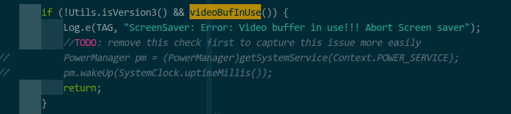

##2.0和3.0相关接口处理方案
1. sn 读取接口
	- 2.0
		/sys/class/aml_keys/aml_keys/key_name
		/sys/class/aml_keys/aml_keys/key_read
		/sys/class/aml_keys/aml_keys/key_write
	- 3.0
		/sys/sys-info/serial_number
		
	处理方案：将sn号写入一个persist property, 2.0中在init进程起来时对key_name写入sn,从key_read中读取出sn号并放入property, 应用层修改相关代码通过读取属性方式对SN统一访问

2. cpu温度访问接口
	- 2.0
	sys/class/thermal/thermal_zone1/temp
	- 3.0
	/sys/class/thermal/thermal_zone0/temp
	
	处理方案:沿用

3. videobufused
	- 2.0
	/sys/class/amstream/videobufused
	- 3.0
	无
	
	处理方案：考察2.0上其功能后新增并提供统一接口，MiniLauncher会对2.0和3.0做判断以确定是否使用该节点，
因此不对该节点做额外处理。

4. HDMI状态信息
	- 2.0
	/sys/class/amhdmitx/amhdmitx0/cec
	/sys/class/amhdmitx/amhdmitx0/aud_cap
	备注：/sys/class/amhdmitx/amhdmitx0　该文件夹下都是关于hdmi状态信息
	- 3.0
	/proc/edid_status
	处理方案：3.0中edid_status包含了HDMI状态信息，设置一个抽象层，2.0和3.0均将这些信息导出该抽象层，修改应用层读取HDMI状态信息实现。

5. 显示器edid数据
	- 2.0
	/sys/class/amhdmitx/amhdmitx0/edid
	- 3.0
	/proc/edid_data
	处理方案：2.0中增加/proc/edid_data节点，将/sys/class/amhdmitx/amhdmitx0/edid数据读入到/proc/edid节点，应用层或framework层通过读取/proc/edid_data获得edid原始数据。

6. LED
	- 2.0
	/proc/sysled
	- 3.0
	/proc/sysled
	处理方案：沿用

